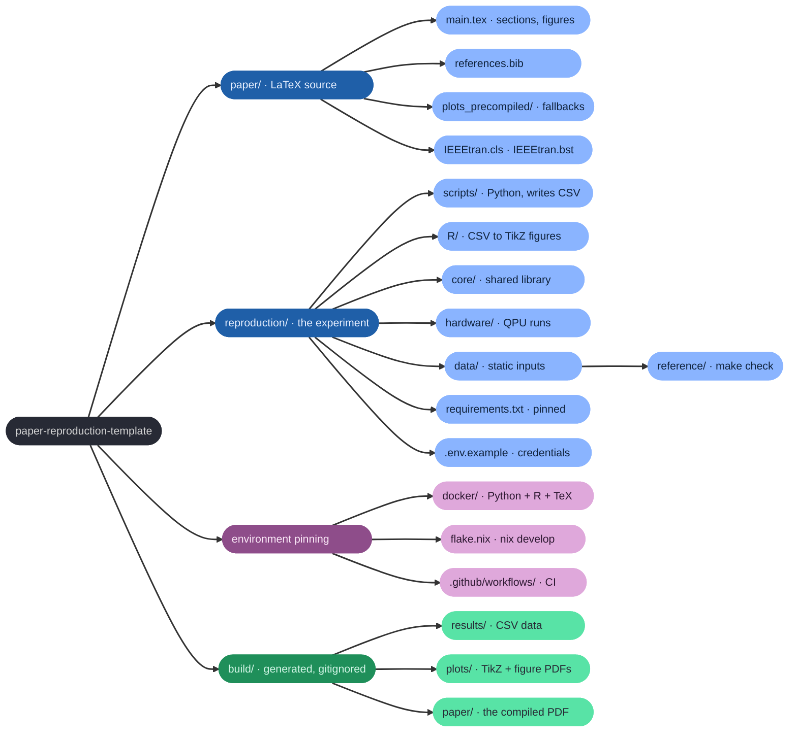

# Paper Reproduction Template

A self-contained project template for **reproducible papers**: one repository
that holds the experiment code, the generated data, the figures and the
camera-ready PDF, wired together by a single `Makefile`.

<p align="center">
  
</p>

<p align="center">
  
</p>


It accompanies [*Works on My QPU: Reproducibility in Quantum Computing
Research*](https://arxiv.org/abs/2607.08348) (IEEE QCE 2026) and implements the
recommendations derived there, following the 1-2-3 reproducibility guidelines
for quantum software experiments ([Mauerer & Scherzinger, SANER 2022](https://doi.org/10.1109/SANER53432.2022.00148)):
a reader can rebuild the paper with one command, regenerate every number with
another, and run both inside a pinned environment.

---

## What you get

| Concern | How the template handles it |
|---|---|
| Build the paper | `make` – `latexmk` + `lualatex`, IEEEtran, output in `build/` |
| Regenerate results | `make reproduce` – Python scripts → CSV → R/TikZ figures |
| Figures without R | committed fallback PDFs in `paper/plots_precompiled/` |
| Verify reproduction | `make check` – fresh CSVs vs. `reproduction/data/reference/` |
| Environment (libraries) | `reproduction/requirements.txt` (pinned) |
| Environment (+ OS libs) | `docker/` – Python + R + TeX Live image |
| Environment (+ everything) | `flake.nix` – `nix develop`, *exploratory* |
| Credentials | `reproduction/.env` (gitignored), `.env.example` documents it |
| Hardware runs | `reproduction/hardware/` – resumable, retrying, logged |
| Double-blind submission | `\setboolean{anonymous}{true}` in `paper/main.tex` |
| Continuous checking | `.github/workflows/ci.yml` runs the pipeline on every push |

---

## Project layout



Blue is committed source, purple pins the environment, green is generated and
safe to delete. `build/` is the only branch that `make clean` removes.

<details>
<summary>The layout as a file tree</summary>

```
paper/                  LaTeX source (IEEEtran, lualatex)
  main.tex              Paper source – title, authors, sections
  references.bib        BibTeX database
  plots_precompiled/    Fallback PDFs used when build/plots/ is absent
  IEEEtran.{cls,bst}    IEEE class and bibliography style (unmodified v1.8b)

reproduction/
  scripts/              Python experiment scripts → CSV in build/results/
  R/                    R plotting scripts (tikzDevice → TikZ fragments)
  core/                 Shared Python library (circuits, noise, ZNE, stats)
  hardware/             Hardware-execution scripts (require credentials)
  data/                 Static read-only inputs; reference/ holds expected results
  logs/                 Hardware run logs (gitignored)
  requirements.txt      Pinned Python dependencies
  .env.example          Credential template – copy to .env, never commit

docker/
  Dockerfile            Python 3.12 + R + TeX Live image
  docker-compose.yml    Services: dev (interactive) and repro (make reproduce)

flake.nix               Nix development shell (TeX Live + R + Python)

build/                  All generated files – gitignored, safe to delete
  paper/                Compiled PDF and LaTeX intermediates
  plots/                TikZ .tex fragments + compiled PDFs
  results/              Generated CSV data
```

</details>

---

## Quick start

### 1 – Local

<p align="center">
  
</p>

```bash
make reproduce  # re-run experiments + figures → build/results, build/plots
make            # build the paper PDF          → build/paper/paper_template.pdf
make check      # do the fresh results match the committed reference?
```

**Prerequisites:** Python ≥ 3.11, R ≥ 4.4, a TeX Live installation with
`lualatex` / `latexmk`, and the R packages listed below.

```bash
# Python environment (the Makefile picks up ./.venv automatically)
python3 -m venv .venv
.venv/bin/pip install -r reproduction/requirements.txt

# R packages (first time only)
Rscript -e "install.packages(
  c('tidyverse','scales','patchwork','tikzDevice','ggnewscale'),
  repos='https://cloud.r-project.org', type='source')"

# Build the paper PDF (uses the committed fallback figures)
make

# Regenerate all data and figures from scratch, then rebuild the PDF
make reproduce && make
```

### 2 – Docker

<p align="center">
  
</p>

```bash
make repro_docker    # build the image, run `make reproduce` inside it, compile the PDF
make dev             # interactive shell in the container
```

The Makefile passes `DOCKER_UID`/`DOCKER_GID` (`id -u` / `id -g`) to Compose, so
the container runs as *you* and generated files are not owned by a foreign uid.
Calling `docker compose` directly without those variables falls back to uid
1000, which cannot write into a checkout owned by anyone else.

### 3 – Nix (exploratory)

`flake.nix` pins the compilers, system libraries and R packages as well, which
`requirements.txt` and Docker do not fully do. Python packages still come from
`requirements.txt` into `./.venv`, created by the shell hook.

<p align="center">
  
</p>

```bash
nix develop
make reproduce && make
```

---

## Make targets

| Target | What it does |
|---|---|
| `make` / `make all` | Compile the paper PDF with `latexmk`. Uses `build/plots/*.tex` if present, otherwise falls back to `paper/plots_precompiled/`. |
| `make reproduce` | Run the experiment scripts → CSVs → R scripts → compile TikZ figures. Does **not** rebuild the PDF. (`make repro` is an alias.) |
| `make plots` | Run R scripts and compile TikZ figures only (assumes CSVs exist). |
| `make check` | Compare freshly generated CSVs with `reproduction/data/reference/`. |
| `make fallback` | Regenerate the committed matplotlib fallback figures. |
| `make repro_docker` | Build the Docker image, run `make reproduce` inside it, compile the PDF. |
| `make dev` | Interactive shell in the Docker container. |
| `make hardware` | Run the experiment on a simulator (`BACKEND=local`, default) or on a device (`BACKEND=ibm`, `BACKEND=mqss` – requires credentials). |
| `make help` | List the targets. |
| `make clean` | Delete the entire `build/` directory. |

---

## How the pipeline fits together

<p align="center">
  
</p>

Two conventions make this robust:

- **Data and figures are separate steps.** Python writes CSV; R reads CSV and
  writes TikZ. Re-plotting never re-runs an experiment, and re-analysis never
  needs a QPU.
- **Figures can be precompiled.** `\includetikz` in `paper/main.tex` prefers
  `build/plots/<name>.tex` and falls back to `paper/plots_precompiled/<name>.pdf`,
  so the paper compiles for readers who have LaTeX but no R.

### Adding a figure

1. Write a Python script in `reproduction/scripts/` that produces a CSV under
   `build/results/`.
2. Write an R script in `reproduction/R/` that reads the CSV and writes a TikZ
   file to `build/plots/` via `save_plot()` from `config.R`.
3. In the `Makefile`, add the figure name to `RAW_PLOTS` and add the dependency
   rules (use the existing `example_zne` rules as a model).
4. In `paper/main.tex`, include it with `\includetikz[width=\columnwidth]{<name>}`.
5. Optionally add a matplotlib fallback to `reproduction/scripts/make_fallback.py`.

### Reference results

`make check` re-runs the experiment and compares the output with the CSVs in
`reproduction/data/reference/`. This distinguishes *code that runs* from *code
that reproduces*: CI runs it on every push, and a reader sees immediately
whether their machine yields the published numbers. Refresh the reference
deliberately when a parameter or a bug fix changes the numbers:

```bash
make reproduce && cp build/results/*.csv reproduction/data/reference/
```

The default tolerances absorb floating-point noise, not a change of
environment: a different simulator or BLAS build can shift a value in its last
bits, and where that value feeds a random draw the sample changes discretely.
Run the check inside the pinned environment (Docker or Nix) before drawing
conclusions from a failure, or loosen it with `--rtol`.

---

## Configuration

### Python environment

The Makefile uses `./.venv/bin/python` when that interpreter exists *and* has
the dependencies installed, and falls back to `python3` otherwise (so a host
venv mounted into the container does not shadow the container's own packages).
Override with `make PY=/path/to/python`.

### R library path

The Makefile sets `R_LIBS_USER=$(HOME)/R/library` when calling `Rscript`:

```bash
Rscript -e "install.packages('<pkg>', lib='~/R/library', type='source')"
```

### Anonymisation

`paper/main.tex` contains an `anonymous` boolean. Set it for double-blind
submission – author names, affiliations and e-mail addresses are censored:

```latex
\setboolean{anonymous}{true}
```

### Hardware credentials

Copy `reproduction/.env.example` to `reproduction/.env` and fill in your
tokens. `.env` is gitignored – **never commit credentials**.

```bash
export $(grep -v '^#' reproduction/.env | xargs)
python reproduction/hardware/run_hardware.py --backend ibm --reps 10
```

`--backend local` runs the same code path against a noisy simulator, so the
hardware pipeline can be tested without credentials or queue time.

---

## Adapting this template for a new paper

Start from a copy of the repository – via GitHub's *Use this template* button,
`gh repo create my-paper --template lfd/paper-reproduction-template`, or a
plain clone – then:

1. **Rename** the job: set `JOB` in the `Makefile` (it names the output PDF).
2. **Replace** the example experiment: delete `reproduction/scripts/example_zne.py`,
   `reproduction/R/plot_example_zne.R`, `reproduction/data/reference/*` and the
   `example_zne` rules in the `Makefile`; add your own.
3. **Trim** `reproduction/core/`: `circuits.py`, `noise.py`, `zne.py` and
   `stats.py` are quantum-error-mitigation helpers – keep what you use, delete
   the rest, and drop the quantum dependencies from `requirements.txt` if your
   paper is not a quantum paper.
4. **Update** the paper: title, authors, abstract and sections in
   `paper/main.tex`; replace the example entries in `paper/references.bib`.
5. **Pin** dependency versions in `reproduction/requirements.txt` once the
   pipeline is final, and refresh `reproduction/data/reference/`.
6. **Point** `\repro` in `paper/main.tex` at the published package
   (repository URL or archive DOI).

---

## Releasing a reproduction package

- Freeze the environment: pinned `requirements.txt`, a built Docker image, and
  `flake.lock` committed.
- Commit reference results and make CI run `make check`.
- Archive the tagged release (e.g. Zenodo) and cite the DOI from the paper.
- State in the paper which claims the package reproduces, and which parts need
  hardware access that a reader will not have.

---

## Citation

The template is a contribution of *Works on My QPU: Reproducibility in Quantum
Computing Research* (IEEE QCE 2026,
[arXiv:2607.08348](https://arxiv.org/abs/2607.08348)), which surveys the state
of reproducibility in quantum computing research and derives the practices
encoded here. Please cite that paper rather than the repository;
[CITATION.cff](CITATION.cff) names it as the preferred citation, so GitHub's
*Cite this repository* button offers it directly.

```bibtex
@misc{koester_repro_2026,
  title  = {Works on My QPU: Reproducibility in Quantum Computing Research},
  author = {Dominik Köster and Maja Franz and Benjamin Zec and Nicole Hoess
            and Ralf Ramsauer and Wolfgang Mauerer},
  year   = {2026},
  eprint = {2607.08348},
  archivePrefix = {arXiv},
  primaryClass  = {quant-ph},
  url    = {https://arxiv.org/abs/2607.08348},
}
```

---

## Licence

MIT for the template's code and documentation – see [LICENSE](LICENSE).

Third-party files shipped with the template keep their own licence:
`paper/IEEEtran.cls` and `paper/IEEEtran.bst` are Michael Shell's unmodified
IEEEtran v1.8b, distributed under the LaTeX Project Public License (LPPL) 1.3
or later, see [ctan.org/pkg/ieeetran](https://ctan.org/pkg/ieeetran).
